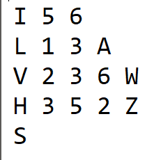
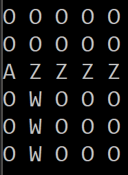
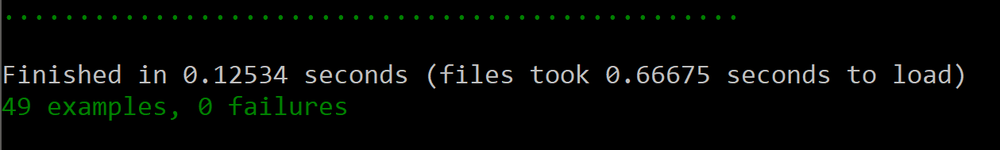

# BitMapEditor    

A Ruby 2.3 program that simulates a basic interactive bitmap editor. Bitmaps
are represented as an M x N matrix of pixels with each element representing a colour. The matrix is oriented as follows.

 

  

  
 

### Running  

`>ruby bin/bitmap_editor examples/show.txt`

### Program input  
The input consists of a file containing a sequence of commands, where a command is
represented by a single capital letter at the beginning of the line. Parameters of the
command are separated by white spaces and they follow the command character.
Pixel coordinates are a pair of integers: a column number between 1 and 250, and a
row number between 1 and 250. Bitmaps starts at coordinates 1,1. Colours are
specified by capital letters.

### Commands  
There are 6 supported commands:
* I N M - Create a new M x N image with all pixels coloured white (O).
*  C - Clears the table, setting all pixels to white (O).
*  L X Y C - Colours the pixel (X,Y) with colour C.
*  V X Y1 Y2 C - Draw a vertical segment of colour C in column X between rows Y1
and Y2 (inclusive).
*  H X1 X2 Y C - Draw a horizontal segment of colour C in row Y between columns
X1 and X2 (inclusive).
*  S - Show the contents of the current image  

### Example  
To run the application you must supply a command file like so bin/bitmap_editor
examples/show.txt  

###### Input File:  
 

###### Expected Output:  
 

### Error Handling

If the command file contains an L X Y C, V X Y1 Y2, or a H X1 X2 Y C command, where X or Y are not within the BitMap, an Index out of bounds exception is raised. In this case the input file will need to be amended accordingly. The input file should not contain any blank lines between commands. Blank lines will result in "unrecognised command ''" error messages. There must be at least one whitespace character separating each parameter of a command eg. 'L    4  3   D' will be accepted, but 'L43D' will not. An input file must consist of a 'I N M' command which creates a BitMap, before any modifying commands can be carried out, otherwise an error message will be printed to the terminal. In the case of subsequent commands which overlap each other, the most recent command will modify a pixel, even if it has previously been written to. If a command file has multiple 'I N M' commands, then all subsequent commands will be carried out on the most recent grid.

### Testing
Unit testing was carried out using the RSPEC gem. The testing modelled a series of test cases for each function and evaluated the outputs compared to the hardwritten answers. An input file was created for each test case when testing the BitmapEditor class.

 

### Design  
This solution identifies two entities, a Bitmap class which models the actual grid of pixels, and a BitmapEditor class which calls functions on the bitmap based on the commands supplied from the input file. The Bitmap class contains all the functions that directly modify the bitmap. These functions are called from the BitmapEditor class which iterates over each line in the command file, executing the appropriate block of code which calls functions to modify the Bitmap. The functionality for modifying the bitmap is isolated into the Bitmap class and is not in the BitmapEditor class so that if changes to the functions, or updates are needed, then these changes can be made, without the need to update the BitmapEditor class which only calls these functions.

 

  

